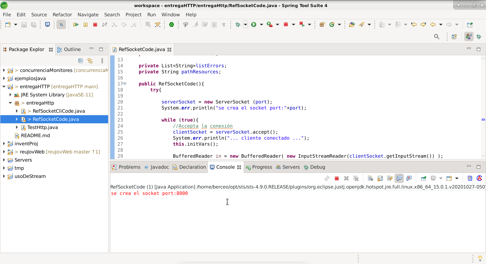

para correr la aplicación de servidor solo se debe ejecutar como una aplicación java standard la clase  RefSocketCode esta clase genera una instancia de Socket que actúa como un servidor en el puerto 8000 de la máquina local

una vez iniciado el servidor se queda a la espera de algún cliente para responder los request  
d) cada responses generador por el servidor lleva todo los headers necesarios para cumplir con el protocolo http 1.1 

c) el response generado lleva como resultado un documento html con el string del recurso solicitado
