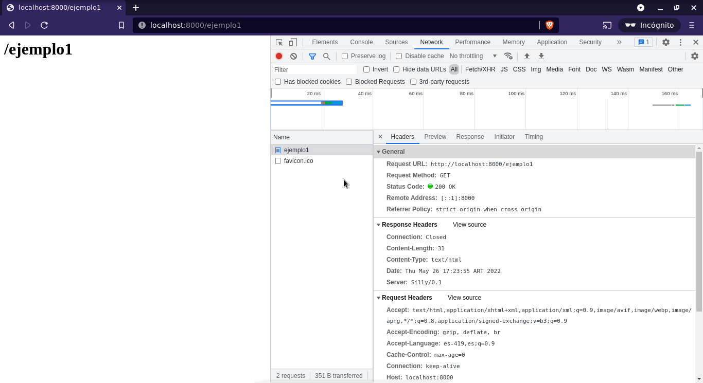
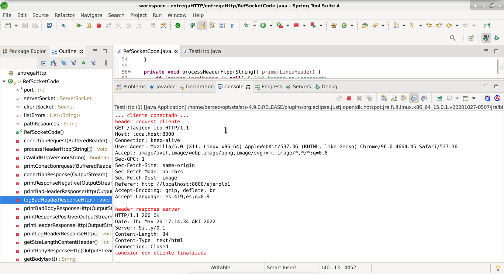

 #### Entrega HTTP

es un mini Servidor de prueba implementado con java sockets para recibir peticiones http 1.0 y http 1.1,generar una respuesta dinamica validando los header de los request recibidos segun el protocolo http

para correr la aplicación de servidor solo se debe ejecutar como una aplicación java standard la clase  ***RefSocketCode*** esta clase genera una instancia de Socket que actúa como un servidor en el puerto 8000 de la máquina local

una vez iniciado el servidor se queda a la espera de algún cliente para responder los request  

d) cada responses generador por el servidor lleva todo los headers necesarios para cumplir con el protocolo http 1.1 

c) el response generado lleva como resultado un documento html con el string del recurso solicitado

http://localhost:8000/ejemplo1

log

### prueba de url con curl ###

	curl http://localhost:8000/ejemplo2

	curl -X POST http://localhost:8000/ejemplo3

	curl -X a...GET http://localhost:8000/ejemplo4

el servidor solo Responde a peticiones GET del protocolo Http 1.0 y Http 1.1
de lo contrario retorna un error cod 405 de http  tanto en el log como en el responses al cliente
